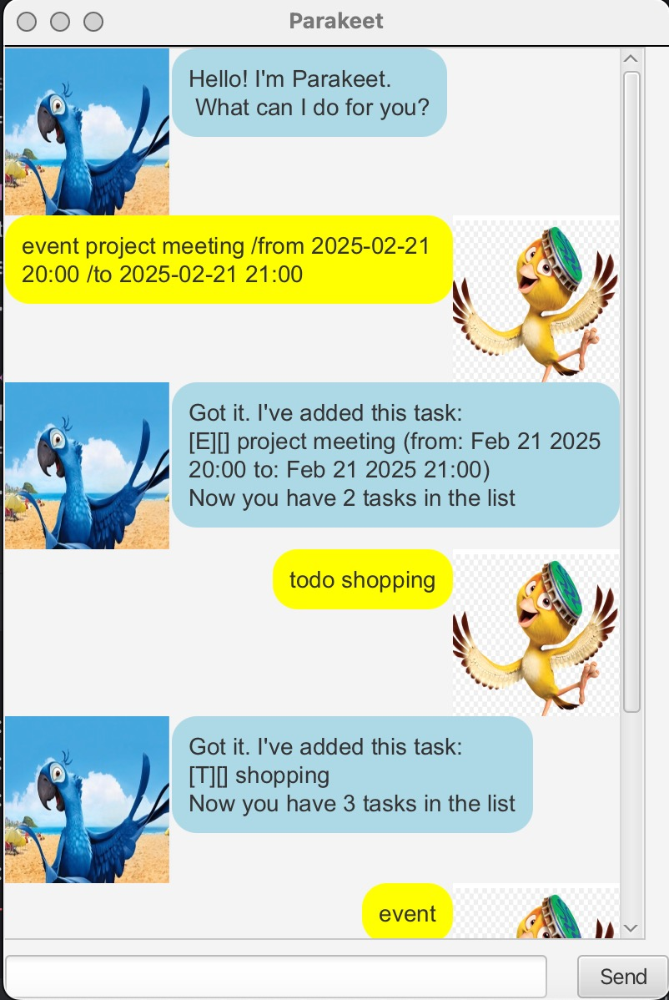

# Parakeet User Guide

Parakeet is a **chatbot** that can help you manage your task easily. It can help you manage **todo**, **deadline** and **event**.

Table of content:
* [Set up](#set-up)
* [Features](#feature-)
    - Adding a todo task: [`todo`](#adding-a-todo-task)
    - Adding a event task: [`event`](#adding-a-deadline-task)
    - Adding a deadline task: [`deadline`](#adding-an-event-task)
    - Listing all tasks: [`list`](#list)
    - Deleting a task: [`delete`](#delete)
    - Mark a task as completed: [`mark`](#mark)
    - Unmark a task as not yet completed: [`unmark`](#unmark)
    - Finding tasks by description: [`find`](#find)
    - Exiting the program: [`bye`](#bye)
* [Saving the data](#saving-the-data)
* [Command summary](#command-summary)

## Set Up:
1. Ensure you have Java `17` installed in your Computer. 
   **Mac User:** Ensure you have the precise JDK version prescribed [here](https://se-education.org/guides/tutorials/javaInstallationMac.html).
2. Download the latest `.jar` file from [here](https://github.com/caroline1233456/ip/releases/tag/v0.2).
3. Open your terminal, `cd` into the folder you put the jar in, and use the `java -jar parakeet.jar`
   command to run the application. 
   A GUI similar to the below should appear in a few seconds.
   

4. Type the command in the command box and press Enter or click the Send button.
5. You can type in commands that are in [command summary](#command-summary) : 
- `todo interview`: Add interview as a todo.
- `event project meeting /from 2025-03-18 12:00 /to 2025-03-18 14:00`: Add project meeting as an event.
- `list` : list all the tasks in the task list.
- `unmark 1`: Unmark the 1st task as not yet completed.
- `delete 1`: Delete the first task.
- `bye`: Exits the app.
6. Refer to the Features below for details of each command

## Feature: 
### Adding a todo task

Add `todo` task to the list of tasks.
- Task with the same description and type(i.e: both of type `todo`) can not be added twice

Format: `todo DESCRIPTION`

Example: `todo go shopping`

### Adding a deadline task

Add a `deadline` task to the task list.

Format: `deadline DESCRIPTION /by DATE (yyyy-mm-dd HH:mm)`

- DATE should be in form of yyyy-mm-dd HH:mm
- Task with the same description, type(i.e: both of type `deadline`) and date can not be added twice

Example: `deadline individual project /by 2025-02-21 16:59`

## Adding an event task
Add `event` task to the task list.

Format: `event DESCRIPTION /from DATE  /to DATE `
- DATE should be in form of yyyy-mm-dd HH:mm
- Replace DESCRIPTION with actual description of the task and DATE with the actual date of the task
- Task with the same description and type(i.e: both of type `event`) and date

Example: `event  project meeting /from 2025-02-21 16:59 /to 2025-02-21 17:35`

## List

Shows a list of all the tasks that have been added

Format: `list`

## Delete

Deletes the specified task in the task list.

Format: `delete INDEX`
- Deletes the task at the specified INDEX.
- The index refers to the index number shown in the displayed task list.
- The index must be a positive integer 1, 2, 3, …​

Example: `delete 1`

## Find

Finds task whose description contains the given keyword.

Format: `find KEYWORD`
- The search is case-insensitive. e.g `Assignment` does not match `assignment`
- The search will match any occurrence of the KEYWORD within a description, even if it is part of a larger word

Example: `find meeting`

## Mark

Marks the specified task as done

Format: `mark INDEX`
- Marks the task at the specified INDEX.
- The index refers to the index number shown in the displayed task list.
- The index must be a positive integer 1, 2, 3, …​

Example:`mark 1`
## Unmark

Unmarks a specified task as yet to complete

Format: `unmark INDEX`
- Unmarks the task as not completed at the specified INDEX.
- The index refers to the index number shown in the displayed task list.
- The index must be a positive integer 1, 2, 3, …​

Example:`unmark 2`

## Bye

Save the current task list and exit the program

Format: `bye`

- Bye command is case-insensitive, e.g: `BYE` and `bye` will both work

## Saving the data
- The parakeet will only save the task list after the user types in  `bye` command or click "X" to exit the GUI.
- The Data is saved in a TXT file.

## Command Summary

| Action                              | Format, Example                                                                                                                               |
|-------------------------------------|-----------------------------------------------------------------------------------------------------------------------------------------------|
| **Add todo task**                   | `todo DESCRIPTION`  e.g., `todo go shopping`                                                                                              |
| **Add deadline task**               | `deadline DESCRIPTION /by yyyy-mm-dd HH:mm ` e,g: `deadline assignment /by 2025-03-18 12:00`                                              |
| **Add event task**                  | `event DESCRIPTION /from yyyy-mm-dd HH:mm /to yyyy-mm-dd HH:mm` e.g., `event project meeting /from 2025-03-18 12:00 /to 2025-03-18 14:00` |
| **List all tasks**                  | `list`                                                                                                                                        |
| **Delete a task**                   | `delete 1`                                                                                                                                    |
| **Mark a task as done**             | `mark 1`                                                                                                                                      |
| **Mark a task as yet to completed** | `unmark 1`                                                                                                                                    |
| **Find tasks that contain keyword** | `find <Keywords...>` e.g., `find meeting`                                                                                                 |                                                                                                                                                    |
| **Exit the program**                | `bye`                                                                                                                                         |